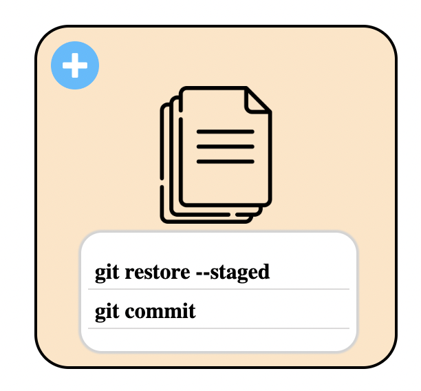

<div align="center">
<div style="display: flex; flex-direction: column; align-items: center; justify-content: center; margin: 40px 0">
   
   <p style="font-weight: 700; font-size: 30px;">Make Your Git Easier</p>
</div></div>

# Tested environment

- machine: macos Ventura 13.3.1
- runtime : node v19.8.1
- libraries
  - axios : v1.4.0
  - express : v4.18.2
  - pug : v3.0.2
  - nodemon : v2.0.20

# Prerequisites

- Install node.js runtime corresponding your machine platform. We highly recommend you to install LTS version.
  - [official node.js site](https://nodejs.org/ko)
- To run local server in your machine, you need to install 'nodemon' package globally. Follow below command. Before running this command, you should have node runtime!!
  ```
   npm i -g nodemon
  ```
- Our project doesn't guarantee that it will work on every browser. we recommend you to use chrome browser.
  - [chrome browser download](https://www.google.com/chrome/?brand=CHBD&brand=CHBD&gclid=Cj0KCQjwmN2iBhCrARIsAG_G2i6teiD4fIvR-a5CQEAxNGkxlercrsgwv6onbD1pMKGr1soGa1exmQEaAm6bEALw_wcB&gclsrc=aw.ds)

# How to run

1. clone our repo or Download source files.
   ```
    git clone https://github.com/OSS-FILEBROWSER/pretty-git.git
   ```
2. First open your terminal. Then, Go to root directory and install dependencies
   ```
   npm install
   ```
3. Run the file server by typing below command and Enjoy it!
   ```
   npm run dev
   ```

# Usages

## 1. Browse directories

You can browse directories by double clicking each directory item. But it is not allowed for you to access in files, no directories or directories that requires system permission.

<div align="center">
<div style="display:flex; justify-content: center;"></div></div>

Also, it is possible to go back to previous browsing history by clicking 'Go to previous' button on the left-top corner.

<div align="center">
<div style="display:flex; justify-content: center;"></div></div>

## 2. Git Commands

You can use some kinds of git commands on your browser. You can use different type of git functions depending on the file status.

When you right-click a file image, git commands that can be executed for each status are given as options. You can easily change git status by clicking options to suit your needs. You can see through the icon that the status of your file has changed as soon as you click the option.

- for [untracked file]

  For the untracked file, you can add the file into staged area.
  Clickk 'git add' option.
<div align="center">
<div style="display:flex; justify-content: center;"></div></div>

- for [modified file]

  For the modified file, you have two choices, 'git restore' and 'git add'.

  1. If you want to change the status from modified to untracked?<br/>
     Click 'git restore' option.
  2. If you want to stage your modification?<br/>
     Click 'git add' option.
 <div align="center">
  <div style="display: flex; justify-content: center;">
    
  </div>
</div>


- for [staged file]

  For the staged file, you can do a couple of git commands, 'git restore --staged' and 'git commit'.

  1. If you want to change the git status from staged to untracked?<br/>
     Click 'git restore --staged' button.
  2. If you want to commit your staged file?<br/>
     Click 'git commit' button.
  <div align="center">
  <div style="display:flex; justify-content: center;"></div></div>

- for [committed and unmodified items]

  Pretty-git will give you three choices, delete, rename, and untrack.

  1. If you want to delete the file on the working directory?<br/>
     Click the 'git rm' option. 
     
  2. If you want to rename your file?<br/>
  Click thd 'git mv' button, then you can face the pop up screen for typing new name you want.
  <div align="center">
  <div style="display:flex; justify-content: center;"></div></div>

  3. If you want to untrack your file?,
  Click the 'git rm --cached' buttton, now the file will be untracked.<br/> 
  <div align="center">
  <div style="display:flex; justify-content: center;"></div></div>

# Features

## 1. git repository

<div align="center">
<div style="display:flex; justify-content: center;"></div><br/></div>
As you browse through the files, you can easily tell if a directory is a git repository by looking at the 'git' icon.

<div align="center">
<div style="display:flex; justify-content: center;"></div><br/></div>

Of course, you can also make your working directory into a git repository by right-clicking on the directory and selecting the 'git init' option. Then 'git' icon will show you on that file.

## 2. git status

You can check the approximate file status through the icon above the file.

- Untracked File Icon <div style="display:flex; justify-content: center;"></div> 

- Staged File Icon <div style="display:flex; justify-content: center;"></div>
- Committed and Modified Icon <div style="display:flex; justify-content: center;"></div>
- Modified File <div style="display:flex; justify-content: center;"></div>
- Ignored Icon <div style="display:flex; justify-content: center;"></div>

You can view more detailed file status(renamed, deleted, modified) of your git repostory in a modal view via the 'git status' button in the upper right corner of the screen.

<div align="center">
<div style="display:flex; justify-content: center;"></div></div>

Allows browsing of .gitignore directories, but limits functionality to files.

# License

Licensed under MIT
Copyright (c) 2023- [codernineteen](https://github.com/codernineteen), [devrocket](https://github.com/devrokket), [dogmania](https://github.com/dogmania)
