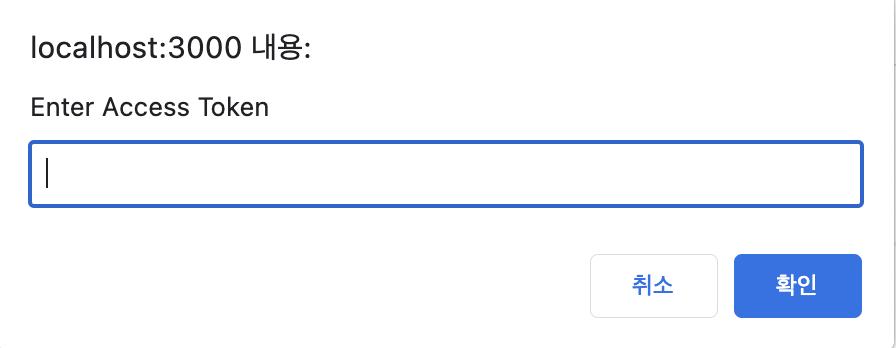
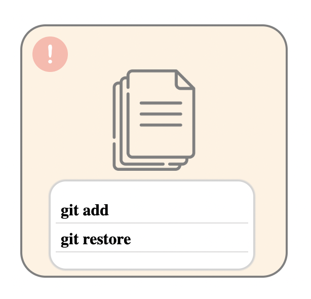

<div align="center">
<div style="display: flex; flex-direction: column; align-items: center; justify-content: center; margin: 40px 0">
   
   <p style="font-weight: 700; font-size: 30px;">Make Your Git Easier</p>
</div></div>

# Tested environment

- machine: MacOS Ventura 13.3.1, Windows OS 11
- runtime : node v19.8.1
- libraries
  - axios : v1.4.0
  - express : v4.18.2
  - pug : v3.0.2
  - nodemon : v2.0.20
  - simple-git: v3.18.0
  - minimatch: v9.0.0

# Prerequisites

- If you don't have a git, Install git first and then config your git account

  - [Git installation](https://git-scm.com/)

  - ```
      git config --global user.email "your email"
      git config --global user.name "your name"
    ```

- Install node.js runtime corresponding your machine platform. We highly recommend you to install LTS version.
  - [official node.js site](https://nodejs.org/ko)
- To run local server in your machine, you need to install 'nodemon' package globally. Follow below command.
  <br>
  Before running this command, check node version and npm version by runngin below commands.
  If you got some errors, re-run your shell or terminal

  ```
    node -v
    npm -v
  ```

  If the node is successfully installed, run below command to install nodemon

  ```
   npm i -g nodemon
  ```

- Install 'simple-git' npm module.

  ```
   npm i simple-git
  ```

- Our project doesn't guarantee that it will work on every browser. We recommend you to use chrome browser.
  - [chrome browser download](https://www.google.com/chrome/?brand=CHBD&brand=CHBD&gclid=Cj0KCQjwmN2iBhCrARIsAG_G2i6teiD4fIvR-a5CQEAxNGkxlercrsgwv6onbD1pMKGr1soGa1exmQEaAm6bEALw_wcB&gclsrc=aw.ds)

# How to run

1. Clone our repo or Download source files.
   ```
    git clone https://github.com/OSS-FILEBROWSER/pretty-git.git
   ```
2. First open your terminal or WindowsShell. Then, Go to root directory of cloned repository and install dependencies
   ```
   npm install
   ```
3. Run the file server by typing below command and Enjoy it!

   ```
   npm run dev
   ```

   <span style="color: orangered;">[Warning]</span> If you already running something on same port, you will see below error.

   ```
   Emitted 'error' event on Server instance at:
       at emitErrorNT (node:net:1801:8)
       at process.processTicksAndRejections (node:internal/process/task_queues:82:21) {
     code: 'EADDRINUSE',
     errno: -48,
     syscall: 'listen',
     address: '::',
     port: 3000
   }

   Node.js v19.8.1
   [nodemon] app crashed - waiting for file changes before starting...
   ```

   You have two choices at this moment.
   a. Kill the port you use and re-run the sever.
   b. Go to src directory('~/pretty-git/src') and modify the `PORT` value inside index.js

   ```
     const PORT = 3000; //<-- modify the number here.
   ```

# New Features in Ver.2

There are new features in version 2. <br>
Branch management, Branch merge, Git commit history, and Git clone from GitHub.

## 1. Branch Mangement
Pretty-git provides you a menu to create, delete, rename, and checkout branches. <br>
Now, you can mangage your branches on the browser.

- Here is the branch menu button. 

<div align="center">
<div style="display:flex; justify-content: center;"></div></div><br>

<div align="center">
<div style="display:flex; justify-content: center;"></div></div><br>

- When you click the branch button to the right of the 'Go Back' button, you can find the branches you made in local environment.
<div align="center">
<div style="display:flex; justify-content: center;"></div></div><br>


- Hovering over the current branch, entry loads the rename button.
<div align="center">
<div style="display:flex; justify-content: center;"></div></div><br>

- Hovering over other branches, entry loads below buttons. You can checkout, delete, merge, and rename the branches. Use the option you want.
<div align="center">
<div style="display:flex; justify-content: center;"></div></div><br>

## 2. Branch merge

- As seen in the image above, you can merge the target branch into the current branch.

- If branch merging process get a problem, like conflict, Pretty-git automatically aborted merge process.

<div align="center">
<div style="display:flex; justify-content: center;"></div></div><br>

- On the other hand, to merge the target branch get no prblem, you can check the success message like this.

<div align="center">
<div style="display:flex; justify-content: center;"></div></div><br>


## 3. Git commit history

- When you click the 'Git Log' button to the left of the 'Git Status' button, Pretty-git will show you the commit history of your project in the form of a graph.

  - Click 'Git Log' button.
<div align="center">
<div style="display:flex; justify-content: center;"></div></div><br>

  - Pretty-git will show you the graph. The graph includes the workflow of the current branch.
<div align="center">
<div style="display:flex; justify-content: center;"></div></div><br>

  - Furthermore, If you choose a commit object shaped yellow circle, Pretty-git will provide the detailed information about the commit. 
<div align="center">
<div style="display:flex; justify-content: center;"></div></div><br>

  - If you want to close the detailed commit tab, just click the 'close' button.

## 4. Git clone from GitHub

You can easily clone both private and public repository using HTTPS of it.

- Click the 'Git Clone' button in the upper-right of the screen.
<div align="center">
<div style="display:flex; justify-content: center;"></div></div><br>

- You should choose 'pubic' or 'private repo' button depending on the type of the repository you want to clone. 

- If you click the 'public repo', Pretty-git will show you the pop-up window to get a repository address. Now you give the address and the cloning is done. 
<div align="center">
<div style="display:flex; justify-content: center;"></div></div><br>

- If you click the 'private repo', It will ask you the address of the repository. 
<div align="center">
<div style="display:flex; justify-content: center;"></div></div><br>

  - If you already have the id and token that needed for cloning, Pretty-git directly clone the private repository.

  - Otherwise, if you have no information that needed for cloning, Pretty-git ask you the id, token about the repository.

<div align="center">
<div style="display:flex; justify-content: center;"></div></div><br>

<div align="center">
<div style="display:flex; justify-content: center;"></div></div><br>

- When you enter the ID and token through the prompt, you can see the information you entered on the global git cofig file. As follows the image, there are user and token inforamtion made below the [github] tag

- If you think an information of the access token is wrong or renew the token information by yourselves, you can update it in .gitconfig, which is global config file of git VCS

<div align="center">
<div style="display:flex; justify-content: center;"></div></div><br>

# Usages

<span style="color: orangered;">[Warning]</span> We assume that you're running our service on English language environment. You should set English to your terminal profile and git language as a default if you don't want to have any problems while using our service.(From v0.3.1, we started to support Korean git status parsing functionality. But it is still unstable)
<br>
Also, Keep in mind that it can't process some tasks if you include special cases and other languages like Korean in the name of your files.

## 1. Browse directories

You can browse directories by double clicking each directory item. But it is not allowed for you to access in files, no directories or directories that requires system permission.

<div align="center">
<div style="display:flex; justify-content: center;"></div></div>

Also, it is possible to go back to previous browsing history by clicking 'Go to previous' button on the left-top corner.

<div align="center">
<div style="display:flex; justify-content: center;"></div></div>

## 2. Git Commands

You can use some kinds of git commands on your browser. You can use different type of git functions depending on the file status.

When you right-click a file image, git commands that can be executed for each status are given as options. You can easily change git status by clicking options to suit your needs. You can see through the icon that the status of your file has changed as soon as you click the option.

### For Untracked Files

For the untracked file, you can add the file into staged area.
Clickk 'git add' option.

  <div align="center">
  <div style="display:flex; justify-content: center;"></div></div>

### For Modified Files

For the modified file, you have two choices, 'git restore' and 'git add'.

1. If you want to change the status from modified to untracked?<br/>
   Click 'git restore' option.
2. If you want to stage your modification?<br/>
Click 'git add' option.
 <div align="center">
  <div style="display: flex; justify-content: center;">
    
  </div>
</div>

### For Staged Files

For the staged file, you can restore staged files to move it into modified stage or discard changes, 'git restore --staged'.

1. If you want to change the git status from staged to untracked?<br/>
Click 'git restore --staged' button.
<div align="center">
<div style="display:flex; justify-content: center;"></div></div>

### For Committed and Unmodified items

Pretty-git will give you three choices, delete, rename, and untrack.

1. If you want to delete the file on the working directory?<br/>
   Click the 'git rm' option.
2. If you want to rename your file?<br/>
Click thd 'git mv' button, then you can face the pop up screen for typing new name you want.
<div align="center">
<div style="display:flex; justify-content: center;"></div></div>

3. If you want to untrack your file?,
Click the 'git rm --cached' buttton, now the file will be untracked.<br/>
<div align="center">
<div style="display:flex; justify-content: center;"></div></div>

4. You should notice that we don't support 'git rm' and 'git rm --cached' with '-r', which means you can't run these commands about directories
<div align="center">
<div style="display:flex; justify-content: center;"></div></div>

# Features

## 1. git repository

As you browse through the files, you can easily tell if a directory is a git repository by looking at the 'git' icon.
<br>

<div align="center">
<div style="display:flex; justify-content: center;"></div><br/></div>

Of course, you can also make your working directory into a git repository by right-clicking on the directory and selecting the 'git init' option. Then 'git' icon will show you on that file.
<br>

<div align="center">
<div style="display:flex; justify-content: center;"></div><br/></div>
<br>

## 2. git status

You can check the approximate file status through the icon above the file.

- Untracked File Icon <div style="display:flex; "></div>
  <br>
- Staged File Icon <div style="display:flex; "></div>
  <br>
- Committed and Modified Icon <div style="display:flex; "></div>
  <br>
- Modified File <div style="display:flex; "></div>
  <br>
- Ignored Icon <div style="display:flex; "></div>

If you request 'git rm', 'git restore', you can't see any of the modified or staged files in GUI view.
Instead, If you click 'git status' button, You can view more detailed file status(renamed, deleted, modified) of your git repostory in a modal view via the 'git status' button in the upper right corner of the screen.

<div align="center">
<div style="display:flex; justify-content: center;"></div></div>

We are providing Integrated commit interface in this modal screen. If you want to commit all the staged at once, you just need to click 'Let`s commit!' button on the right-top corner.

<div align="center">
<div style="display:flex; justify-content: center;"></div></div>
Then, Type any message that you want to include in your new commit.
<div align="center">
<div style="display:flex; justify-content: center;"></div></div>
Finally, if you click '확인' or 'yes' buttom on prompt, you can get this alert after successful commit
<div align="center">
<div style="display:flex; justify-content: center;"></div></div>

You are allowed to browse in ignored directories, but are restricted to do functionalities that we supports.

# Dependencies

- axios for sending Request to APIs(MIT License)
- express to handle views and server logic(MIT License)
- pug for view template engine(MIT License)
- node runtime, node fs module, node path module(MIT License)
- minimatch for regular expression pattern check(ISC License)
- simple-git for git commands(MIT License)
- icons from flaticon (private use and commercial usage allowed)

# License

Licensed under MIT
Copyright (c) 2023- [codernineteen](https://github.com/codernineteen), [devrocket](https://github.com/devrokket), [dogmania](https://github.com/dogmania)
